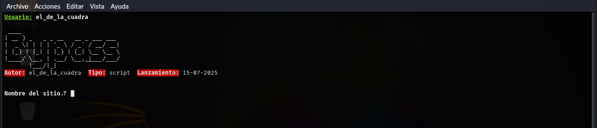
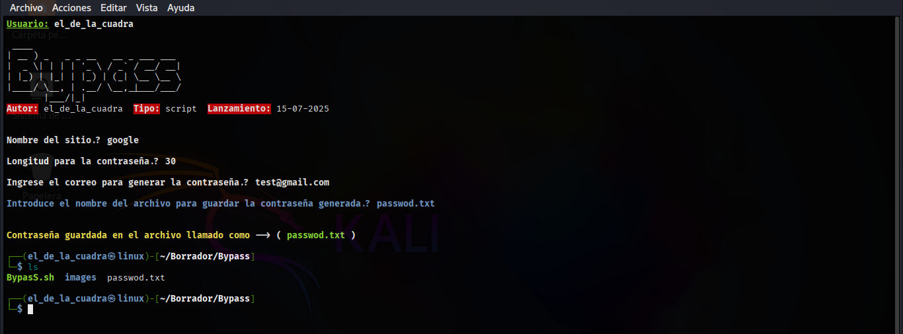

# Bypass
sencilla herramienta para generar contraseñas para tus sitios web. (Bypass)

# Instalacion.
clone el repositorio de github [Bypass](https://github.com/ElDeLaCuadra-0708202329/Bypass.git).

```sh
git clone https://github.com/ElDeLaCuadra-0708202329/Bypass.git
```
luego entre en la carpeta llamada Bypass.

```sh
cd && ls
```
Ejecute el siguiente comando para conceder los permisos de ejecucion.

```sh
chmod +x BypasS.sh install.sh
```
y por ultimo instalar las dependencias.

```sh
sudo bash install.sh
```
Ejecutar herramienta.

```sh
sudo bash BypasS.sh
```

# Imagen de muestra.
<p align="center"></p>

# Captura de pantalla.
<p align="center"></p>


